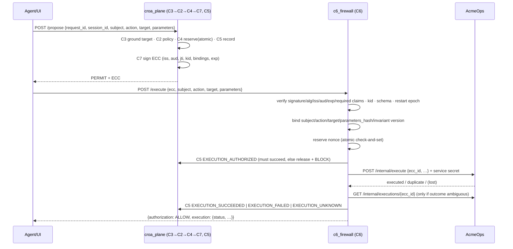

# Architecture — CROA Enterprise Reference Pilot #001

CROA (Constrained Reachability Orchestration Architecture) separates **proposal** from **execution
authority**. An agent may propose an operation; only a cryptographically valid Execution Change
Contract (ECC) issued by the control plane can carry that operation across the execution boundary,
and an independent firewall (C6) decides admission without consulting the control plane.

## Components

| Component | Role | Pilot realization |
|---|---|---|
| C1 Policy | Static policy content and trajectory invariants | `croa_plane/c1_policy.py` — six rules, one invariant, first-match, default deny |
| C2 Governor | Orders the checks and produces the authorization decision | `croa_plane/c2_governor.py` |
| C3 Context Grounding | Is the target a registered resource of the right type? | `croa_plane/c3_resolver.py` |
| C4 Trajectory Invariants | Cumulative-authority limits, reserved **atomically** at permit time | `croa_plane/c4_trajectory.py` |
| C5 Evidence | Hash-chained, anchored, fail-closed JSONL log | `croa_plane/c5_evidence.py` |
| C7 Contract Compiler | Issues RS256 ECCs (see `ECC-SPEC.md`) | `croa_plane/c7_compiler.py` |
| C6 Execution Firewall | Verifies ECC, binds it to the operation, redeems once, executes, records outcome truthfully | `c6_firewall/main.py` |
| AcmeOps | Simulated protected target; authenticates C6; idempotent on `ecc_id` | `acmeops_api/main.py` |
| UI | Demonstration client | `ui/index.html` |

C1–C5 and C7 are co-located in one process for the pilot. This is a deployment choice, not a CROA
requirement; `PRODUCTION-MAPPING.md` separates them.

## Happy path

## Denial paths

Every denial before the boundary (C3, C2, C4) is returned to the caller **and** forwarded to C6's
`/refuse` endpoint so the boundary's own evidence trail contains it. If C6 is unreachable the denial
still stands; only the boundary-side evidence is lost.

Denials at the boundary (missing/forged/expired/mismatched/replayed ECC) never reach the target and
are recorded by C6 with `claims_verified: false` when the claims could not be authenticated.

## Key design decisions

See `docs/adr/`:
1. Trajectory budget is reserved at permit time, not at target commit.
2. The nonce is burned before execution, not after (at-most-once).
3. Evidence fails closed: unreadable, truncated or externally modified history stops the plane.
4. C6 refuses ECCs issued before its own boot (restart epoch) because its replay registry is in-memory.
5. Authorization and execution outcomes are separate, and execution outcomes include `UNKNOWN`.
