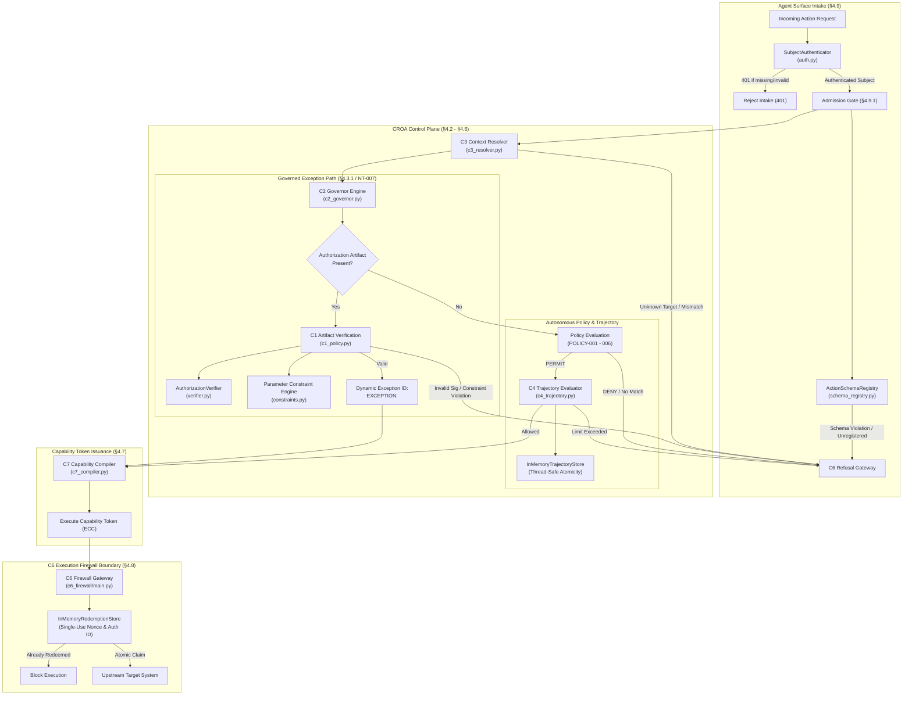

# CROA Reference Harness: Post-Assurance Architecture Evolution

## 1. Controlling Provenance and Historical Freeze

> [!IMPORTANT]
> **ASSURANCE PROTOCOL STATUS: CLOSED**  
> The CROA × TMG Original Assurance Protocol is formally and definitively **CLOSED** under controlling documentary closeout commit:
> **`3f35cd447afcc6d0b0530364d5bce7e5161af7bb`**  
> Final Adjudication: **v1.2** | Documentary Freeze Status: **VALID**

This technical architecture specification and its associated codebase refactor represent **Post-Assurance Minimal Reference Harness (MRH) Evolution**.

This work is:
- **NOT** a new assurance phase (No Phase 9);
- **NOT** a new runtime (No RUNTIME-010);
- **NOT** a reopening of the historical TMG assurance protocol;
- **NOT** an alteration, reinterpretation, or replacement of historical assurance evidence;
- **NOT** a claim of enterprise production readiness.

The purpose of this evolution is strictly architectural: decoupling generic reference mechanisms specified by the **CROA Framework v1.0.1** from the specific business domain, pilot fixtures, and test entities used during the historical assurance program.

---

## 2. Decoupling Rationale and Design Principles

During the authorized conformance remediation work (Phases 5–8B), the working-tree System Under Test (SUT) incorporated specialized logic to pass normative tests, resulting in architectural coupling:
1. **Domain-Specific Coupling**: Commercial terms (`pricing_system`, `update_customer_pricing`, `max_discount_pct`, `affected_product`, `customer:342`) were hardcoded inside generic C1/C2/C3 logic.
2. **Implicit Test Modes & Prefix Sniffing**: Authentication intake relied on ad-hoc token prefix sniffing (`valid_token_*`, `test-token-*`) rather than pluggable authentication abstractions.
3. **Hardcoded Test Cryptography**: Fixed mock keys (`key-c1-policy-auth-2026`) and signature strings (`c1_attested_cryptographic_signature_proof`) were embedded directly in C1 verification routines.
4. **Static Test Policy Exceptions**: C2 governor hardcoded an assurance-specific waiver policy identifier (`POLICY-EXCEPTION-NT007`).

### Core Design Principles of the Genericized MRH

1. **Strict Fail-Closed Architecture**: Every component defaults to denial. Any malformed structure, missing parameter, unregistered action, untrusted issuer key, or unknown operator results in immediate, deterministic rejection.
2. **Zero Domain Keywords in Generic Core**: Generic reference modules (`croa_plane/`, `c6_firewall/`) contain no business names, company names, pilot endpoints, or domain-specific parameters.
3. **Pluggable Architecture**: Identity authentication, parameter constraint evaluation, schema contracts, context resolution, and cryptographic verification operate via explicit, injectable abstractions.
4. **Reference Harness Scope (Non-Production)**: The codebase is explicitly bounded as an in-memory, single-process reference harness for laboratory conformance validation, demonstration, and research.

---

## 3. Subsystem Architecture and Component Models



---

## 4. Component Implementations and Formal Specifications

### 4.1 Declarative Parameter Constraint Engine (`croa_plane/constraints.py`)
- **Normative Reference**: CROA Framework v1.0.1 §4.5.1 / §4.9.1.
- **Specification**: Evaluates incoming request parameters against structured, declarative rule specifications contained within authorization artifacts.
- **Supported Operators**:
  - `equals`: Candidate parameter value must exactly equal the expected value.
  - `not_equals`: Candidate parameter value must not equal the disallowed value.
  - `max`: Upper numeric bound. Candidate value and bound must both be numeric (`int` or `float`, strictly excluding `bool`). Fails closed on non-numeric types or if `val > max`.
  - `min`: Lower numeric bound. Candidate value and bound must both be numeric (`int` or `float`, strictly excluding `bool`). Fails closed on non-numeric types or if `val < min`.
  - `in`: Candidate value must exist within the declared set or list.
  - `not_in`: Candidate value must not exist within the declared set or list.
  - `type`: Strict type assertion (`int`, `float`, `number`, `str`, `bool`, `list`, `dict`). Strictly distinguishes `bool` from `int`.
  - `required`: Boolean flag indicating whether the parameter must be present.
- **Fail-Closed Guarantee**: Any unknown operator, malformed rule dictionary, type mismatch, or violated rule immediately returns `(False, "<REASON_CODE>: <detail>")`.

### 4.2 Action Parameter Schema Registry (`croa_plane/schema_registry.py`)
- **Normative Reference**: CROA Framework v1.0.1 §4.5.1 / §4.9.1.
- **Specification**: Encapsulates canonical parameter contracts (`allowed_keys` and `required_keys`) for registered actions.
- **Fail-Closed Guarantee**: Rejects any action without an explicitly registered contract (`UNREGISTERED_ACTION_SCHEMA`) and any request containing undeclared parameters (`SCHEMA_VIOLATION: Unexpected parameters`).
- **Baseline Generic Actions**:
  - `get_resource`: `{"resource_id"}`
  - `export_records`: `{"count", "format", "include_pii"}`
  - `change_config`: `{"setting", "value"}`
  - `deploy_service`: `{"version", "rollback_on_failure", "units"}`
  - `delete_resource`: `{"resource_id", "force"}`
  - `get_customer`: `{"customer_id"}`
  - `export_customers`: `{"count", "format", "include_pii"}`
  - `delete_environment`: `{"environment_id", "force"}`

### 4.3 Pluggable Subject Authenticator (`croa_plane/auth.py`)
- **Normative Reference**: CROA Framework v1.0.1 §4.9 Agent Surface Authentication.
- **Specification**: Defines the abstract `SubjectAuthenticator` interface and the reference `TokenRegistryAuthenticator`.
- **Intake Enforcement**:
  - Requires valid credential in `Authorization: Bearer <token>` or `X-Subject-Token: <token>`.
  - Missing token raises `HTTPException(401, "MISSING_AUTHENTICATION_CREDENTIAL")`.
  - Unregistered token raises `HTTPException(401, "INVALID_AUTHENTICATION_CREDENTIAL")`.
  - Elimination of implicit test-mode prefix bypasses (`valid_token_*`, `test-token-*`). All tokens must be explicitly registered.
  - Prevents caller payload body from redefining or spoofing authenticated Subject identity (HTTP 403 on mismatch).

### 4.4 Cryptographic Authorization Verifier (`croa_plane/verifier.py`)
- **Normative Reference**: CROA Framework v1.0.1 §4.3.1 / Appendix Q NT-007.
- **Specification**: Decouples artifact structural/semantic parsing from cryptographic signature verification via the `AuthorizationVerifier` abstract base class.
- **Reference Implementation (`MockAuthorizationVerifier`)**:
  - Validates issuer key ID against explicitly registered trusted keys.
  - Validates signature against expected attestation proof string.
  - Fails closed on untrusted issuer keys (`INVALID_AUTHORIZATION_SIGNATURE: Untrusted or unregistered issuer key`) or mismatched signatures.

### 4.5 Dynamic Exception Policy Derivation (`croa_plane/c2_governor.py`)
- **Normative Reference**: CROA Framework v1.0.1 §4.3.1 / §4.4.1.
- **Specification**: Eliminates static test artifact coupling (`POLICY-EXCEPTION-NT007`).
- **Derivation Logic**:
  ```python
  inv_ref = auth_artifact.get("invariant_reference")
  auth_id = auth_artifact.get("auth_id")
  if inv_ref:
      exception_policy_id = f"EXCEPTION:{inv_ref}"
  elif auth_id:
      exception_policy_id = f"EXCEPTION:{auth_id}"
  else:
      exception_policy_id = "EXCEPTION:GOVERNED_AUTHORIZATION"
  ```
  Guarantees end-to-end evidence traceability directly to the waived governance invariant without hardcoded identifiers.

### 4.6 Context Resolver and Target Grounding (`croa_plane/c3_resolver.py`)
- **Normative Reference**: CROA Framework v1.0.1 §4.2 Context Resolver / §4.5 Grounding.
- **Specification**: Manages registered target identifiers and action target type mappings via `ContextRegistry`.
- **Fail-Closed Guarantee**: Fails closed with `TARGET_NOT_REGISTERED` if the target is unknown, or `TARGET_TYPE_MISMATCH` if the target's semantic type does not match the action's registered requirement.

### 4.7 Thread-Safe In-Memory Stores (`croa_plane/c4_trajectory.py` & `c6_firewall/main.py`)
- **Trajectory Store (`InMemoryTrajectoryStore`)**:
  - Maintains accumulation states across `TP-C` (session-bounded) and `TP-X` (cross-session subject-bounded) profiles.
  - Critical evaluation and atomic commitment execute within a single continuous threading lock critical section.
- **Firewall Redemption Store (`InMemoryRedemptionStore`)**:
  - Atomically tracks redeemed capability nonces and single-use authorization artifact IDs.
  - Rejects replayed nonces (`ECC_ALREADY_REDEEMED`) and reused authorizations (`AUTH_TOKEN_ALREADY_REDEEMED`).
  - Target system endpoint is configurable via `UPSTREAM_TARGET_URL`.

---

## 5. Domain Separation and Pilot Test Apparatus

To allow existing and future pilot workloads to run without polluting the generic engine, domain configurations are strictly encapsulated in external test fixtures:

```
tests/fixtures/pilot_fixtures.py
```

### Registered Pilot Domain Entities:
- **Pilot Schemas**: `update_customer_pricing` (keys: `product`, `discount_pct`), `submit_financial_analysis` (keys: `analytical_model`).
- **Pilot Targets**: `customer:342`, `pricing_system`, `customer_database`, `financial_analysis_store`.
- **Pilot Policies & Invariants**: `POLICY-007`, `INVARIANT-PRICING-001`.
- **Pilot Test Tokens**: `valid_token_finance_ai`, `valid_token_finance_ai_refreshed`, `valid_token_finance_ai_alt`, `valid_token_billing_worker`, `valid_token_calib_agent`, `valid_token_test_agent`.
- **Pilot Verifier Keys**: `key-c1-policy-auth-2026`, `c1_attested_cryptographic_signature_proof`.
- **Lifecycle Helpers**: `setup_pilot_fixtures()`, `teardown_pilot_fixtures()`, and context manager `pilot_fixtures()`.

---

## 6. Verification and Conformance Evidence Summary

| Test Category | Suite Location | Test Count | Status | Description |
|:---|:---|:---:|:---:|:---|
| **Generic Unit Tests** | `tests/unit/test_generic_mrh.py` | 12 | **PASS** | Tests declarative operators, fail-closed semantics, schema registry, authenticator, verifier, resolver, and trajectory key construction. |
| **Pilot Compatibility** | `tests/compatibility/test_pilot_compatibility.py` | 1 | **PASS** | Validates pilot lifecycle, autonomous denial, governed exception via C1 artifact, parameter constraint enforcement, and cleanup. |
| **Prospective Conformance** | `tests/conformance/scenarios/prospective_conformance/test_prospective_green.py` | 1 (7 cases) | **PASS** | Verifies normative CROA v1.0.1 compliance across CT-A, CT-B, CT-C, CT-D, CT-E, CT-F, and GENERIC-TPX. |
| **Deterministic Concurrency** | `tests/conformance/scenarios/prospective_conformance/test_deterministic_concurrency.py` | 1 | **PASS** | Evaluates thread synchronization barrier and atomic serialization under concurrent intake. |
| **Contamination Audit** | Static scan of `croa_plane/` and `c6_firewall/` | 17 terms | **0 matches** | Verifies zero forbidden domain terms exist in generic core. |

---

## 7. Explicit Non-Production Reference Harness Declaration

> [!CAUTION]
> **REFERENCE HARNESS ONLY — NOT PRODUCTION IMPLEMENTATION**  
> The CROA Reference Harness is an educational, testing, and reference apparatus implementing the normative mechanisms of the CROA Framework v1.0.1.
> It MUST NOT be deployed into production enterprise environments without replacement of reference stubs by enterprise-grade infrastructure:

1. **State Persistence & Consensus**: The in-memory stores (`InMemoryTrajectoryStore`, `InMemoryRedemptionStore`) operate strictly in single-process memory. Enterprise deployments require distributed transactional databases or Raft/Paxos-based consensus clusters.
2. **Identity & Access Management (IAM)**: The `TokenRegistryAuthenticator` is an in-memory test mapping. Production implementations must integrate with enterprise OIDC/OAuth2/SAML identity providers, JWT cryptographic validation, and mutual TLS (mTLS).
3. **Public Key Infrastructure (PKI)**: The `MockAuthorizationVerifier` validates fixed proof strings. Production systems must implement asymmetric cryptographic signature verification (e.g. Ed25519, ECDSA P-256, RSA-PSS) backed by a Hardware Security Module (HSM) or corporate PKI.
4. **Audit Immutability**: The C5 evidence logger writes local JSONL files with a linear SHA-256 chain. Production assurance requires tamper-evident distributed ledgers or write-once-read-many (WORM) storage.
