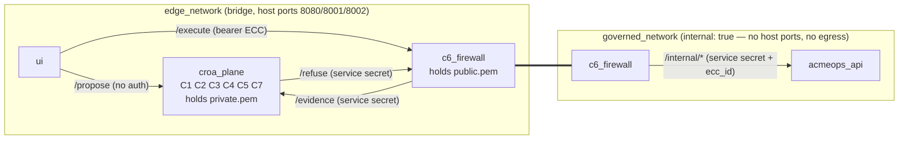

# Trust Boundaries

## Who authenticates whom (pilot)

| Caller → Callee | Mechanism | What it proves | Enterprise replacement |
|---|---|---|---|
| Browser → croa_plane `/propose` | none | nothing — **`session_id` and `subject` are trusted inputs** | Agent surface with AuthN; session minted server-side |
| Browser → croa_plane demo endpoints | `X-Demo-Control-Secret` | operator intent, local only | not present in production |
| Browser → C6 `/execute` | bearer ECC | possession of a valid contract | ECC + caller identity (mTLS/workload identity) |
| croa_plane → C6 `/refuse` | shared `INTERNAL_SERVICE_SECRET` | caller is inside the deployment | mTLS / SPIFFE |
| C6 → croa_plane `/evidence` | shared secret | same | mTLS; separate evidence service |
| C6 → AcmeOps `/internal/*` | shared secret **and** network reachability | the target authenticates its firewall | mTLS / workload identity; target verifies ECC itself |
| C6 → ECC | RS256 signature, `kid`, `iss`, `aud` | the control plane signed this exact operation | same, with KMS-held keys and JWKS rotation |

## What crosses each boundary

- **Private key** never leaves `croa_plane`. It is mounted read-only at runtime from `./keys/`, not
  built into the image (`.dockerignore` excludes `*.pem`).
- **Public key** is mounted into C6 only. C6 derives `kid` from it and refuses other key ids.
- **ECC** is a bearer token: anyone holding it can present it once, within its TTL, for exactly the
  bound operation. Subject binding is a string match, not identity authentication.
- **`ecc_id`** crosses into the target as the idempotency and reconciliation key.

## What the topology does and does not prove

The compose topology proves that `ui` and `croa_plane` cannot open a TCP connection to `acmeops_api`.
It does not model the Docker host itself, `docker exec`, or a compromised C6 container; those are
outside the pilot's threat model (see `THREAT-MODEL.md`).
